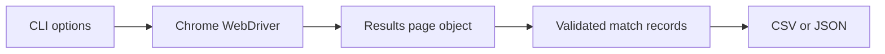

# Football Results Browser Automation

[](https://github.com/yasirsavanur/Selenium/actions/workflows/tests.yml)

A Selenium WebDriver project that navigates a dynamic football statistics website, selects a country, league and season, switches to the complete match view, extracts the results and exports a clean CSV or JSON dataset.

The repository started as an unfinished browser script. It is now a small automation application with a page-object model, explicit waits, deterministic browser tests, failure evidence and continuous integration.

## What it demonstrates

- Selenium WebDriver interaction with a JavaScript-rendered page
- Reliable element location with CSS selectors, XPath and semantic IDs
- Explicit waits and DOM-stability checks instead of fixed sleeps
- Reusable page-object design instead of one long procedural script
- Dynamic dropdown selection for country, league and season
- Normal browser clicks with a controlled fallback for intercepted elements
- Extraction and validation of structured data from repeated table rows
- Removal of duplicate matches rendered under multiple team panels
- Headless execution and automatic driver discovery through Selenium Manager
- Screenshots and HTML snapshots when a run or browser test fails
- Pytest browser tests, coverage checks, linting and GitHub Actions CI

## Workflow



## Quick start

Python 3.10 or newer and Google Chrome are recommended.

```bash
git clone https://github.com/yasirsavanur/Selenium.git
cd Selenium
python -m venv .venv
source .venv/bin/activate
python -m pip install -e .
```

Run the default England and Premier League extraction in headless Chrome:

```bash
football-results --output data/premier_league.csv
```

Choose the filters explicitly and watch the browser work:

```bash
football-results \
  --country England \
  --league "Premier League" \
  --season "2025/2026" \
  --output data/premier_league_2025_26.json \
  --headed \
  --screenshot artifacts/completed_run.png
```

The original filename remains available as a compatibility launcher after installation:

```bash
python webdriver.py --country England --league "Premier League"
```

On Windows, activate the virtual environment with `.venv\Scripts\activate`.

## Output

CSV output contains one row per unique completed match:

| Field | Meaning |
| --- | --- |
| `date` | Match date shown on the page |
| `country`, `league`, `season` | Competition filters used for the run |
| `home_team`, `away_team`, `score` | Extracted result |
| `home_goals`, `away_goals`, `total_goals` | Parsed numeric fields |
| `outcome` | Home win, draw or away win |
| `source_url` | Page used for provenance |

JSON output adds a UTC generation timestamp and match count. Every successful run also prints a compact summary containing the number of matches, goal average, result split and date range.

## Tests and quality checks

Install the development dependencies and run the same checks used in CI:

```bash
python -m pip install -e ".[dev]"
ruff check .
pytest \
  --cov=football_results_scraper \
  --cov-report=term-missing \
  --html=artifacts/test-report.html \
  --self-contained-html
```

The browser tests use a local HTML fixture that mirrors the relevant live DOM. This keeps CI deterministic and still exercises real Chrome interactions, dropdown selection, clicking, row extraction and deduplication. The live website is intentionally not called from CI because network or layout changes should not make an otherwise healthy test suite flaky.

GitHub Actions runs the suite on Python 3.10 and 3.12 using the Chrome and ChromeDriver installed on the Ubuntu runner. It uploads the HTML test report and any failure screenshots as workflow artifacts.

## Project structure

```text
.
├── .github/workflows/tests.yml
├── src/football_results_scraper
│   ├── browser.py
│   ├── cli.py
│   ├── exporters.py
│   ├── models.py
│   └── pages/results_page.py
├── tests
│   ├── fixtures/results_page.html
│   ├── conftest.py
│   ├── test_exporters.py
│   ├── test_models.py
│   └── test_results_page.py
├── pyproject.toml
└── webdriver.py
```

## Design notes

The project uses Selenium's built-in Selenium Manager, so there is no hard-coded driver path and no separate driver-manager dependency. Browser sessions are wrapped in a context manager so Chrome is closed even after an exception. The page object owns all selectors and waiting behaviour, while the models and exporters remain browser-independent and easy to test.

If the live page changes, the run exits with a non-zero status and writes `artifacts/failure.png` and `artifacts/failure.html`. These files show what Selenium actually saw and make selector failures much easier to diagnose.

## Responsible use

This project is intended as a compact browser automation and data engineering demonstration. It does not bypass login or premium controls. Use it at a sensible frequency and follow the source website's terms and robots policy. The extracted data belongs to its original publisher.

Data source: [Adam Choi Football Statistics](https://www.adamchoi.co.uk/overs/detailed)

## Author

Yasir Ahmed Savanur

[Portfolio](https://yasirsavanur.github.io/) · [GitHub](https://github.com/yasirsavanur)
